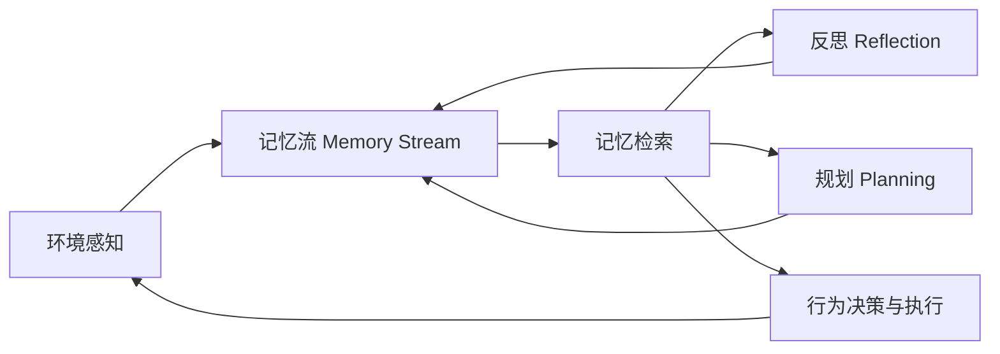

# 斯坦福小镇

## 一、论文基础信息与核心定位

| 项目 | 核心信息 |
| --- | --- |
| 论文标题 | Generative Agents: Interactive Simulacra of Human Behavior（生成式智能体：人类行为的交互式模拟） |
| 发表会议 | UIST 2023（CCF A类人机交互顶会） |
| 作者单位 | 斯坦福大学 + Google Research/DeepMind |
| 核心定位 | 大语言模型时代AI智能体领域的奠基性工作，首次提出了可模拟可信人类行为的生成式智能体架构，实现了开放世界中智能体的长时序行为一致性、经验泛化与群体社交行为涌现 |
| 核心成果 | 搭建了类《模拟人生》的Smallville沙盒小镇，部署25个生成式智能体，无人工脚本干预下实现了信息扩散、关系建立、群体协同等类人类社会的涌现行为 |
| 引用数据 | 截至2026年4月，总引用量1033+，总下载量66000+，是AI Agent领域引用量最高的经典工作之一 |

---

## 二、研究背景与核心痛点

### 1. 研究愿景

可信的人类行为代理可以赋能沉浸式虚拟环境、人际沟通演练空间、社交系统原型设计、游戏开放世界NPC、社会科学理论验证等多个场景，核心目标是让计算智能体模拟出符合过往经验、适配环境变化、具备长期一致性的类人行为。

### 2. 行业核心痛点

| 传统方案 | 核心局限 |
| --- | --- |
| 规则式脚本（有限状态机、行为树） | 依赖人工全量编写行为逻辑，无法覆盖开放世界的全场景交互，无法生成未预设的新行为 |
| 强化学习（RL） | 仅在有明确奖励函数的对抗场景有效，无法适配无明确目标的开放世界人类行为模拟，泛化能力差 |
| 纯大语言模型（LLM） | 仅能实现单时间点的行为模拟，无法处理长时序记忆的存储与检索、无法实现经验泛化、行为短视无长期一致性，上下文窗口限制无法承载全量长期经验 |

### 3. 论文核心贡献

1.  提出**生成式智能体**范式，实现了基于动态经验与环境的可信人类行为模拟；
    
2.  设计了以**记忆流、反思、规划**为三大核心的智能体架构，解决了LLM在长时序行为模拟中的核心痛点；
    
3.  通过控制实验与端到端实验，验证了架构各模块的因果贡献，量化了智能体的行为可信度与群体涌现能力；
    
4.  系统分析了生成式智能体的应用场景、技术边界、伦理风险与合规使用原则。
    

---

## 三、重点一：Smallville斯坦福小镇底层设计

Smallville是论文搭建的像素风沙盒虚拟小镇，是25个生成式智能体的生存与交互载体，也是验证生成式智能体能力的核心实验环境，整体设计完全服务于开放世界的人类行为模拟。

### 1. 沙盒环境的底层结构设计

采用**树形数据结构**构建整个小镇，实现智能体行为与环境状态的双向联动，结构如下：

*   根节点：整个Smallville小镇
    
*   一级子节点：核心功能区域，包括住宅、咖啡馆、酒吧、公园、学院、药店、杂货店、宿舍、花园等完整小镇生活场景
    
*   二级子节点：区域内的子空间，例如住宅内的厨房、卧室、卫生间、花园，咖啡馆内的前台、用餐区、后厨
    
*   叶子节点：子空间内的具体物体，例如厨房的炉灶、冰箱、水槽，卧室的床、书桌、衣柜，每个物体都有**自然语言描述的状态属性**（如炉灶：关闭/开启/正在燃烧；商店：营业/关门）
    

#### 关键设计规则

*   非全知设定：每个智能体仅拥有**专属的环境认知子树**，仅存储自己亲眼见过、感知过的区域与物体，离开区域后状态信息会过期，仅重新进入时刷新最新状态；
    
*   双向联动：智能体的行为可以修改物体状态，物体状态变化也会触发智能体的行为反应；
    
*   空间约束：所有行为必须匹配对应空间的物体与功能（如做饭必须在厨房、睡觉必须在床上）。
    

### 2. 25个智能体的初始化设计

25个智能体采用\*\*「统一架构底座+个性化初始记忆锚定」\*\*的设计，无任何预编写的行为脚本，所有个体差异完全来自初始人设与种子记忆。

#### （1）统一架构底座

25个智能体全部搭载完整的生成式智能体架构，底层统一基于GPT-3.5-turbo实现，遵循完全一致的「感知→检索→推理→行动→记忆归档」闭环运行逻辑，每个游戏时间步（1分钟）独立完成一次决策，无中心化全局控制。

#### （2）个性化初始化规则

论文通过一段**分号分隔的自然语言人设描述**为每个智能体定义核心身份，每一个分号分隔的短句，都会作为一条初始观察记忆写入该智能体的记忆流，成为行为的初始锚点。人设描述必须覆盖：

1.  基础身份：姓名、年龄、核心性格特质；
    
2.  职业/学业属性：小镇中的社会角色、核心工作/学习内容；
    
3.  社会关系：家人、朋友、同事、邻居的完整社交图谱；
    
4.  核心兴趣与行为习惯：日常行为偏好、核心动机；
    
5.  初始环境认知：初始知晓的小镇区域与场所。
    

#### （3）典型智能体示例

*   **John Lin**：Willow市场和药店的店主，乐于助人；与大学教授妻子Mei Lin、音乐专业学生儿子Eddy Lin同住，非常爱家人；与同事Tom Moreno是好友，常一起讨论本地政治；与邻居Sam Moore相识多年，认可其为人。
    
*   **Isabella Rodriguez**：Hobbs咖啡馆店主，核心初始意图为举办情人节派对，是小镇信息传播与群体协同的核心节点。
    
*   **Klaus Mueller**：20岁，社会学专业学生，专注于绅士化研究，性格内敛，是验证反思模块能力的核心样本。
    
*   **Sam Moore**：小镇退休居民，核心初始意图为竞选小镇市长，是信息扩散实验的核心发起者。
    

25个智能体覆盖了店主、学生、职场人、退休人员等全角色，形成了完整的小镇社会生态。

### 3. 三大核心交互体系

#### （1）智能体与环境的交互

是所有行为的基础，核心实现逻辑为「感知-决策-执行-状态更新-记忆归档」，核心交互模式包括：

1.  **环境感知与认知更新**：智能体移动时实时感知当前空间的区域、物体与状态，更新自己的环境认知子树与记忆流；
    
2.  **自主移动与空间导航**：基于行为目标，从环境认知子树中定位最优目标空间，通过路径算法完成移动；
    
3.  **物体状态主动修改**：通过行为主动修改环境物体的状态（如打开炉灶、整理货架），同步更新环境结构与记忆流；
    
4.  **环境变化触发的即时反应**：感知到环境异常变化（如炉灶燃烧、淋浴漏水）时，中断原有计划，生成对应的反应行为。
    

#### （2）智能体之间的交互

完全自发产生，无预编写对话脚本，所有交互内容都会存入双方记忆流，核心交互模式包括5类：

1.  **基础寒暄与信息交换**：空间内相遇后发起日常对话，交换个人近况，是所有深度社交的基础；
    
2.  **事件信息扩散**：通过对话将知晓的关键事件传递给其他智能体，接收方会在后续交互中继续传播，形成自发的小镇信息网络；
    
3.  **社交关系建立与维护**：首次交互完成相识，后续交互中体现对过往对话的记忆，实现关系的持续深化；
    
4.  **深度话题交流与认知迭代**：基于共同兴趣/事件发起深度对话，交换观点，更新自我认知；
    
5.  **群体协同与邀约协作**：通过对话发起邀约、分配任务、协调时间，完成多智能体的群体协同（如情人节派对的全流程组织）。
    

#### （3）用户与智能体/环境的交互

用户可通过三种方式干预沙盒世界，触发智能体的行为变化：

1.  自然语言交互：以指定身份（如记者）与任意智能体对话，智能体会基于对话内容更新记忆与行为；
    
2.  指令干预：以「内层声音」的身份向智能体下达指令，智能体将其视为核心目标，更新计划与行为；
    
3.  环境修改：直接修改环境中物体的状态，触发智能体的即时反应。
    

### 4. 核心涌现行为验证

论文通过Smallville环境，验证了生成式智能体无人工干预下的三大类人类社会涌现行为：

1.  **信息扩散**：Sam的市长竞选信息从1人知晓扩散至32%的智能体，Isabella的情人节派对信息从1人知晓扩散至52%的智能体；
    
2.  **关系建立**：2天模拟后，小镇智能体的社交网络密度从初始的0.167提升至0.74，仅1.3%的关系认知存在幻觉；
    
3.  **群体协同**：仅给Isabella设置「举办情人节派对」的初始意图，智能体自发完成了邀请传播、场地装饰、私人邀约、按时到场的全流程协同，最终5名智能体自发到场参与。
    

---

## 四、重点二：生成式智能体核心架构与技术细节

生成式智能体的核心架构，完全围绕「解决LLM长时序行为模拟的核心痛点」设计，三大核心模块**记忆流、反思、规划**形成完整闭环，所有模块均基于自然语言实现，可无缝对接LLM的生成能力。

### 1. 核心模块1：记忆的底层存储与更新策略

记忆流是架构的核心底座，是智能体所有经验、行为、认知的唯一载体，论文采用**全量永久存储、标准化结构、分类型统一管理**的设计。

#### （1）底层存储架构

*   每个智能体拥有**完全独立、隔离的专属记忆流数据库**，25个智能体的记忆流互不连通；
    
*   采用**追加写模式**，所有记忆永久全量存储，无任何删除/淘汰机制，仅通过检索机制筛选高相关记忆；
    
*   所有记忆统一存储，仅通过类型字段区分「观察、反思、计划」三类，检索时一视同仁参与评分。
    

#### （2）单条记忆的标准化数据结构

每条记忆包含8个固定字段，是检索、推理、规划的基础：

| 字段 | 核心说明 |
| --- | --- |
| 记忆ID | 唯一主键，用于关联引用、检索定位 |
| 自然语言描述 | 记忆的核心内容，全程自然语言存储，是LLM推理的唯一素材 |
| 记忆类型 | 枚举值：观察（基础感知）、反思（高阶洞察）、计划（行为规划） |
| 创建时间戳 | 记忆写入的精确游戏时间，精确到分钟，用于新近度计算 |
| 最近访问时间戳 | 记忆最后一次被检索召回的时间，每次被检索实时更新，用于新近度计算 |
| 重要性分数 | 1-10的整数，记忆创建时由LLM生成，终身不变，区分日常琐事与核心事件 |
| 引用指针列表 | 仅反思/计划类记忆必填，记录该记忆推导所依赖的原始记忆ID，用于溯源 |
| 嵌入向量 | 记忆描述对应的LLM嵌入向量，用于相关性维度的余弦相似度计算 |

#### （3）三大核心记忆类型的存储规则

| 记忆类型 | 定义 | 生成时机 | 重要性分布 |
| --- | --- | --- | --- |
| 观察类 | 智能体对环境、行为、对话的直接感知记录，是记忆流的基础 | 每个时间步感知后、行为执行后、对话结束后，实时写入 | 1-4分，日常琐事1-2分，核心交互3-4分，占记忆流90%以上 |
| 反思类 | 对底层观察的高阶抽象、归纳、推理结论，实现经验泛化 | 近期新增记忆重要性总分超阈值150时触发，每日2-3次 | 5-10分，核心认知8-10分，必须标注溯源引用 |
| 计划类 | 未来行为的时序规划，保证长时序行为一致性 | 每日凌晨生成单日计划、时段前拆解细粒度动作、环境变化时更新计划 | 3-7分，核心计划5-7分，细粒度动作3-4分 |

#### （4）记忆流全生命周期更新策略

1.  **初始注入**：模拟启动前，将人设描述的每个短句拆分为独立初始记忆，写入记忆流，设置固定的时间戳、重要性分数与嵌入向量；
    
2.  **实时新增**：满足环境感知、行为执行、对话交互、计划生成、反思生成任一触发条件时，实时生成新记忆并写入；
    
3.  **元数据动态更新**：记忆写入后，仅「最近访问时间戳」会动态更新——只要该记忆被检索召回，就会实时刷新为当前游戏时间；
    
4.  **递归关联归档**：新生成的反思/计划记忆，会引用底层的原始记忆，形成反思树与计划迭代链路，保证可追溯性；
    
5.  **永久留存**：无任何记忆删除机制，所有记忆永久存储，仅通过检索机制筛选。
    

### 2. 核心模块2：细粒度记忆检索机制

检索是连接记忆流与LLM推理的核心桥梁，论文采用\*\*「新近度+重要性+相关性」三维度等权重加权融合\*\*的检索机制，解决了LLM上下文窗口有限、无法承载全量长时序记忆的核心痛点。

#### （1）检索触发场景

智能体的每一次决策前，都会触发一次检索，包括：

*   每个时间步决定下一步行为前；
    
*   感知到其他智能体，决定是否发起/回应对话前；
    
*   生成对话内容、计划、反思前；
    
*   响应环境突发变化/用户指令前。
    

#### （2）检索完整执行流程

1.  生成检索Query：基于当前决策场景，由LLM生成1-3个核心检索Query，锚定记忆相关性；
    
2.  全量记忆遍历：遍历记忆流所有条目，为每条记忆计算三大维度的原始分数；
    
3.  分数归一化：通过min-max归一化，将三个维度的分数统一映射到\[0,1\]区间，消除量纲差异；
    
4.  加权融合计算最终得分：三个维度等权重加权求和，得到每条记忆的最终检索得分；
    
5.  排序与截断：按最终得分从高到低排序，取Top-N条记忆，直到总token数接近LLM上下文窗口阈值（论文中预留3000token）；
    
6.  元数据更新与输出：更新所有被召回记忆的最近访问时间戳，将记忆描述拼接为上下文输入LLM。
    

#### （3）三大维度的核心计算规则

论文固定了三个维度的计算参数，所有智能体统一使用，无个性化调整。

| 维度 | 核心逻辑 | 计算规则 |
| --- | --- | --- |
| 新近度（Recency） | 优先召回近期发生/访问的记忆 | 指数衰减函数，衰减基数0.995，衰减单位为游戏小时 公式： |
| 重要性（Importance） | 优先召回对人设/决策更关键的记忆 | 记忆创建时通过固定Prompt让LLM生成1-10的整数分数，终身不变 Prompt核心逻辑：1=日常琐事（刷牙、铺床），10=极端重要事件（分手、大学录取） |
| 相关性（Relevance） | 优先召回与当前Query语义最匹配的记忆 | 计算记忆嵌入向量与Query嵌入向量的余弦相似度，原始分数为相似度结果 |

#### （4）最终得分融合公式

$\text{Final Retrieval Score} = \text{Normalized Recency} + \text{Normalized Importance} + \text{Normalized Relevance}$

论文中固定三个维度的权重均为1，等权重融合。

### 3. 核心模块3：反思模块的经验泛化逻辑

反思模块解决了纯观察记忆无法实现经验泛化、深度推理的痛点，让智能体从零散的日常观察中提炼高阶洞察，形成对自我、他人、环境的深度认知。

#### （1）触发机制

当智能体近期新增记忆的重要性分数总和超过**阈值150**时触发，每日约触发2-3次。

#### （2）生成流程

1.  生成核心问题：提取最近100条记忆，输入LLM生成3个最突出的高阶问题（如「John Lin如何更好地服务小镇的老年顾客？」）；
    
2.  关联记忆检索：以生成的问题为Query，检索记忆流中相关的观察与过往反思；
    
3.  高阶洞察提取：输入LLM，生成带溯源证据的高阶洞察，格式为「洞察结论（因为记忆ID1、ID3、ID5）」；
    
4.  记忆归档：将每条洞察作为独立的反思记忆写入记忆流，标注引用指针，重要性分数8-10分。
    

#### （3）核心价值

反思记忆会参与后续的检索与推理，直接迭代智能体的行为决策，实现从「被动感知」到「主动认知」的升级，例如John Lin通过反思生成「老年顾客需要放大版的用药说明」的洞察后，立刻落地了对应的行为。

### 4. 核心模块4：自上而下的细粒度规划生成机制

规划模块解决了纯LLM行为短视、长时序一致性差的痛点，通过三级递归拆解，生成从单日框架到分钟级动作的连贯行为计划，同时支持动态更新。

#### （1）核心生成逻辑

*   记忆锚定：所有计划生成前必须先检索相关记忆，保证计划符合人设、过往经验与反思结论；
    
*   自上而下递归拆解：从粗到细三级拆解，仅提前拆解即将执行的时段，避免与实时环境脱节；
    
*   动态可更新：环境突发变化时，实时重写当前时间点之后的计划，保证灵活性。
    

#### （2）三级拆解的细粒度生成规则

| 层级 | 生成时机 | 时间粒度 | 核心生成规则 |
| --- | --- | --- | --- |
| 第一层：单日粗粒度计划 | 每日凌晨5:00固定生成 | 1-4小时/块，单日拆分为5-8个行为块 | 1. 前置检索：核心人设、前一日计划完成情况、未完成任务、反思结论； 2. 输出固定格式的编号列表，包含时间窗口与核心行为； 3. 作为计划记忆写入记忆流，重要性5-7分。 |
| 第二层：小时级计划 | 每个行为块开始前1小时 | 1小时/条 | 1. 前置检索：与该行为块相关的记忆、环境认知； 2. 将单日粗计划的每个块，拆解为小时级子计划，包含开始时间、持续时长、目标地点、核心行为； 3. 作为计划记忆写入记忆流，重要性4-5分。 |
| 第三层：5-15分钟细粒度动作 | 每个小时开始前5分钟 | 5-15分钟/条 | 1. 前置检索：小时级计划、目标地点的环境认知子树； 2. 拆解为可直接执行的具体动作，无模糊描述，必须匹配环境物体与空间； 3. 作为计划记忆写入记忆流，重要性3-4分。 |

#### （3）计划的动态更新规则

当感知到环境突发变化、对话触发新约定、用户下达指令时，触发计划重写：

1.  仅重写**当前时间点之后**的计划，已完成的计划保留归档，不做修改；
    
2.  仅微调单日粗计划，核心重写小时级计划与细粒度动作；
    
3.  旧计划标记为「已失效」，新计划写入记忆流并标注溯源引用；
    
4.  按新计划执行后续行为。
    

---

## 五、实验验证与核心结论

论文通过两类互补的实验，从个体能力与群体涌现两个维度，完整验证了生成式智能体架构的有效性。

### 1. 控制评估：验证架构各模块的因果贡献

*   实验设计：对完成2天模拟的智能体进行5大类25个问题的自然语言访谈，覆盖自我认知、记忆检索、规划能力、场景反应、反思推理5个维度；招募100名人类评估者，对5种条件下的回复进行可信度排序。
    
*   实验条件：完整架构、无反思架构、无反思无规划架构、全消融架构（无记忆/反思/规划）、人工撰写基线。
    
*   核心量化结果：
    
    1.  完整架构的TrueSkill评分为**29.89**，显著优于所有消融条件与人工基线，每移除一个核心模块，性能均显著下降；
        
    2.  完整架构对比全消融基线（此前行业SOTA），效应量达**d=8.16**，差距达到8个标准差，证明架构设计带来了质的提升；
        
    3.  统计检验证实，除人工基线与全消融基线外，所有两两对比均有显著差异（p<0.001）。
        

### 2. 端到端评估：验证群体涌现行为

*   实验设计：25个智能体在Smallville中无干预持续交互2个完整游戏日，观察其信息扩散、关系建立、群体协同的涌现行为。
    
*   核心量化结果：
    
    1.  信息扩散：Sam的市长竞选信息从1人扩散至8人（32%），Isabella的派对信息从1人扩散至13人（52%），无幻觉式虚假信息传播；
        
    2.  关系建立：小镇社交网络密度从0.167提升至0.74，仅1.3%的关系认知存在幻觉；
        
    3.  群体协同：12个收到派对邀请的智能体中，5人按时到场参与，3人因日程冲突无法参与，完成了从初始意图到群体协同的完整闭环。
        

### 3. 典型错误模式

论文也明确了架构的三类典型错误，是后续优化的核心方向：

1.  记忆检索失败：无法召回相关记忆，导致行为与过往经验脱节；
    
2.  记忆虚构与美化：对记忆进行幻觉式 embellishment，甚至编造未发生的事件；
    
3.  行为规范偏差：对场景的隐性规则理解不到位（如下班后进入商店），或受LLM指令调优影响，对话过于正式、过度合作。
    

---

## 六、研究局限、伦理风险与未来方向

### 1. 核心研究局限

1.  检索性能仍有优化空间，三维度权重固定，未做个性化调优；
    
2.  算力成本极高，25个智能体2天模拟需数千美元Token成本，无法支持大规模、长时序的模拟；
    
3.  评估周期较短，仅验证了2天的模拟效果，未验证长时序下的行为一致性；
    
4.  鲁棒性不足，存在prompt注入、记忆篡改、幻觉等风险，且会继承底层LLM的偏见与公平性问题。
    

### 2. 核心伦理与社会风险

1.  拟社会关系风险：用户可能对智能体产生拟人化的情感依赖，形成不健康的拟社会关系；
    
2.  错误传导风险：在高风险场景中，智能体的错误推断可能造成用户的实质伤害；
    
3.  滥用风险：被用于深度伪造、虚假信息传播、定向说服、恶意舆情操纵等场景；
    
4.  人类输入替代风险：在设计、社会科学研究中，替代真实人类的输入与反馈，导致结论脱离真实需求。
    

### 3. 论文提出的风险缓解原则

1.  强制披露：智能体必须明确告知用户自身的计算实体属性，避免认知混淆；
    
2.  审计日志：平台必须维护完整的输入输出审计日志，实现恶意使用的可追溯；
    
3.  价值对齐：对底层LLM做价值对齐，避免智能体产生不当交互行为；
    
4.  边界明确：仅将智能体作为早期原型验证工具，永远不替代真实人类的输入与反馈。
    

### 4. 未来研究方向

1.  优化检索模块与架构性能，降低算力成本，实现实时交互；
    
2.  开展长时序模拟验证，建立更严谨的行为可信度评估基准；
    
3.  提升智能体的鲁棒性，解决幻觉、记忆篡改等安全问题；
    
4.  优化底层LLM的偏见问题，提升对边缘群体的行为模拟准确性。
    

---

## 七、汇报总结与Q&A

### 核心总结

1.  这篇工作是AI Agent领域的奠基性论文，首次系统性地解决了LLM在开放世界人类行为模拟中的长时序记忆、经验泛化、行为一致性三大核心痛点；
    
2.  核心创新在于提出了**记忆流+反思+规划**的闭环架构，通过三维度加权检索、高阶反思泛化、三级递归规划，实现了可信的类人行为模拟；
    
3.  通过Smallville沙盒实验，首次验证了AI智能体群体中，无人工干预下的信息扩散、关系建立、群体协同等人类社会涌现行为；
    
4.  该工作为后续AI Agent、游戏NPC、虚拟人、社交系统模拟等领域的研究，提供了核心的架构范式与实验思路。
    

## 举例说明完整流程

# 生成式智能体完整一天的全流程示例：Klaus Mueller（2月13日，周三）

本示例100%贴合论文原文的人设、架构规则、沙盒交互逻辑，完整还原**记忆流存储更新、三维度记忆检索、反思机制、三级规划拆解**四大核心技术模块的运行细节，与此前John Lin的示例处于同一时间线，完全复用Smallville小镇的底层运行规则，无脱离论文设定的虚构内容，可直接用于组会汇报的原理演示。

## 一、前置基础信息

### 1. 智能体核心人设与初始种子记忆（论文原文）

Klaus Mueller，男，20岁，Smallville小镇Oak Hill学院社会学专业本科生；核心性格：内敛严谨、专注学术、关注社会公平、不善无意义社交，对有共同研究话题的人会主动交流。 初始种子记忆（模拟启动前写入记忆流的核心锚点）：

*   学业：Oak Hill学院社会学专业大三学生，核心研究方向为**城市低收入社区的绅士化现象及其社会影响**，正在撰写本科毕业论文，截止日期为3月初；
    
*   社交：与同宿舍邻居Wolfgang Schulz（数学专业学生）相识，仅日常点头之交，无深度交流；与同校同学Maria Lopez、Ayesha Khan相识，三人有共同的学术写作需求，曾交流过论文写作经验；
    
*   行为习惯：每日早7点起床，大部分时间在学院图书馆度过，习惯在Hobbs咖啡馆买午餐，下午会去Johnson公园散步寻找研究灵感，不喜欢喧闹的社交场合；
    
*   前置记忆（前一天2月12日新增，存入记忆流）：
    
    1.  和图书馆管理员沟通，获取了绅士化研究的相关文献资料；
        
    2.  在图书馆遇到Wolfgang Schulz，对方给了自己一份数学建模分析社区人口变化的参考资料；
        
    3.  和Ayesha Khan聊了论文写作的时间规划，约定后续交流写作心得；
        
    4.  完成了论文文献综述的第一部分，发现缺少本地社区的一手访谈数据。
        

### 2. 底层运行规则

*   架构：完整搭载论文提出的**记忆流+反思+规划**三大核心模块，底层基于GPT-3.5-turbo；
    
*   时间规则：沙盒1秒现实时间=1分钟游戏时间，每1分钟为一个决策步，智能体每步完成一次「环境感知→记忆检索→推理决策→行为执行→记忆归档」的闭环；
    
*   环境：Smallville小镇，核心活动空间为Oak Hill学院学生宿舍、学院图书馆、Hobbs咖啡馆、Johnson公园、小镇主干道；
    
*   核心约束：非全知设定，仅能感知当前所在空间的环境、物体与其他智能体，环境认知树仅在进入新区域时更新。
    

## 二、完整一天的分时段全流程拆解

### 阶段1：凌晨5:00-6:00 睡眠状态→单日计划生成

#### 核心行为

Klaus处于睡眠状态，系统完成两个核心后台动作，是单日行为的底层框架：

1.  **前一日反思归档**：2月12日晚触发的反思结论，正式存入记忆流，核心包括：
    
    *   「我的论文核心瓶颈是缺少本地社区的一手数据，需要尽快补充访谈或调研内容」（基于当日论文写作的观察合成）；
        
    *   「Wolfgang虽然和我不熟，但他的数学建模能力能帮我完善论文的数据分析，应该多主动和他交流」（基于Wolfgang提供资料的观察合成）；
        
    *   「Ayesha和我有相似的论文写作压力，和她交流能有效缓解焦虑，还能互相提修改意见」（基于和Ayesha对话的观察合成）。
        
2.  **单日粗粒度计划生成**：基于Klaus的人设、核心记忆、前一日计划完成情况，规划模块**自上而下**生成2月13日的单日核心计划（6个核心模块，存入记忆流）：
    
    1.  6:00-8:00 起床，完成晨间例行流程，去学院食堂吃早餐；
        
    2.  8:00-12:00 到学院图书馆，完成论文文献综述的修改，整理调研数据；
        
    3.  12:00-13:00 午休，去Hobbs咖啡馆买午餐，短暂休息；
        
    4.  13:00-17:00 下午图书馆写作，补充论文的数据分析部分，尝试联系社区获取调研权限；
        
    5.  17:00-18:00 去Johnson公园散步，梳理论文框架，寻找灵感；
        
    6.  18:00-22:00 回宿舍，晚间论文修改，睡前准备，22:30前入睡。
        

#### 架构运行细节

*   规划模块先生成单日粗计划，再递归拆解为**小时级动作**，后续每个时段前，再拆解为5-15分钟的细粒度行为；
    
*   计划生成前，触发了全量记忆检索，以「Klaus Mueller的核心身份、2月13日核心目标、前一日未完成任务」为Query，通过**新近度、重要性、相关性**三维度加权，召回了论文截止日期、前一日反思结论、写作瓶颈等核心记忆，保证计划完全贴合人设与过往行为；
    
*   生成的完整单日计划，作为一条计划类记忆写入记忆流，重要性评分6分，附带创建时间戳、引用指针（指向计划生成所依赖的核心记忆ID）。
    

---

### 阶段2：6:00-8:00 晨间例行流程→与宿舍邻居Wolfgang的交互

#### 6:00-7:00 基础晨间行为

1.  **6:00 起床触发**：计划模块触发起床动作，Klaus生成行为「Klaus Mueller从床上起身，整理床铺」；
    
    *   环境交互：系统将宿舍卧室「床」的状态从「被占用」修改为「空闲」；
        
    *   记忆流更新：新增观察记录「6:00，我起床并整理了床铺」，重要性评分1分。
        
2.  **6:05-6:40 洗漱、晨间护理**：计划拆解为细粒度动作，依次完成「走进卫生间→刷牙→洗脸→换好外出的衣服」；
    
    *   环境交互：依次修改卫生间「洗漱台」的状态，完成后恢复为空闲；
        
    *   记忆流更新：新增多条晨间行为的观察记录，重要性评分均为1-2分。
        
3.  **6:40-7:00 晨间学习准备**：走进宿舍书桌前，整理书包，把电脑、笔记本、论文文献放进书包，查看了前一天打印的研究资料；
    
    *   环境交互：修改宿舍「书桌」的状态从「杂乱」改为「已整理」；
        
    *   记忆检索：触发记忆检索，召回「论文缺少本地社区一手数据」的反思结论，记忆流新增观察记录「6:50，我整理了论文文献，今天需要重点解决调研数据的问题」，重要性评分3分。
        

#### 7:00-7:40 与Wolfgang Schulz的交互

1.  **7:00 感知触发**：Wolfgang Schulz从隔壁卧室走出，进入宿舍公共客厅空间，Klaus实时感知到周边的Wolfgang，触发交互决策；
    
    *   记忆检索：系统以「Wolfgang Schulz是谁？我和他的过往关系？」为Query，检索记忆流中相关内容，召回核心记忆：
        
        1.  「Wolfgang是我的同宿舍邻居，数学专业学生，和我不熟，仅日常点头之交」（初始种子记忆）；
            
        2.  「前一天Wolfgang给了我一份数学建模分析社区人口变化的参考资料，对我的论文很有帮助」（2月12日最新记忆，新近度评分最高）；
            
        3.  「Wolfgang的数学建模能力能帮我完善论文的数据分析，应该多主动和他交流」（前一日反思结论，重要性评分8分，权重最高）；
            
    *   决策结果：主动发起对话，而非擦肩而过，打破此前的陌生状态。
        
2.  **7:05-7:25 多轮对话交互**：
    
    *   Klaus：早上好Wolfgang，昨天你给我的那份社区人口建模的资料，帮了我大忙，真的很谢谢你。
        
    *   Wolfgang：早上好Klaus，不用客气，我之前做课程作业用过，觉得对你的研究可能有用。
        
    *   Klaus：我看了你的建模方法，正好能解决我论文里绅士化对社区人口结构影响的分析问题，不知道你今天有没有空，想请教你几个建模的细节？
        
    *   Wolfgang：没问题，我今天下午没课，3点左右可以在图书馆找你，给你讲讲具体的公式和用法。
        
    *   Klaus：太好了，太感谢了，我下午3点在图书馆二楼等你。
        
3.  **交互后动作**：
    
    *   记忆流更新：Klaus的记忆流新增完整对话记录，每条记录的重要性评分为5分（核心学术帮助，高于日常琐事）；Wolfgang的记忆流同步新增对话记录；
        
    *   计划微调：Klaus将下午15:00-16:00的「论文写作」计划，更新为「和Wolfgang沟通数学建模细节」，作为新的计划记忆写入记忆流，引用指针指向本次对话的记忆ID；
        
    *   环境交互：7:30，Klaus背上书包，离开宿舍，前往学院食堂吃早餐。
        

#### 7:40-8:00 早餐与计划确认

Klaus在学院食堂买了早餐，一边吃一边在笔记本上列好了今天要问Wolfgang的建模问题，记忆流新增观察记录「7:50，我列好了3个核心的建模问题，下午和Wolfgang沟通」，重要性评分3分，无计划调整，继续执行8点前往图书馆的原有计划。

---

### 阶段3：8:00-12:00 上午图书馆工作→环境交互与记忆流持续更新

#### 8:00-8:15 环境感知与认知更新

1.  **8:00 进入图书馆**：Klaus从食堂出发，沿小镇主干道走到Oak Hill学院图书馆，推开图书馆大门进入大厅；
    
    *   环境交互：系统将图书馆「大门」的状态从「关闭」修改为「开启」；
        
    *   环境认知更新：Klaus的环境认知子树刷新图书馆的区域状态，确认图书馆处于「营业中」，二楼自习区、文献检索区、前台均开放；
        
    *   记忆流更新：新增观察记录「8:00，我进入了Oak Hill学院图书馆，图书馆正常开放」，重要性评分2分。
        
2.  **8:10-8:15 寻找座位**：Klaus走到图书馆二楼自习区，选择了靠窗的空座位坐下，打开电脑和笔记本，摆放好文献资料；
    
    *   环境交互：修改自习区「靠窗座位」的状态从「空闲」修改为「被占用」；
        
    *   记忆流更新：新增观察记录「8:15，我在图书馆二楼靠窗的座位坐下，准备开始论文写作」，重要性评分2分。
        

#### 8:15-12:00 论文写作与核心行为执行

1.  **核心行为拆解**：规划模块将「8:00-12:00 论文写作」的粗计划，递归拆解为5-15分钟的细粒度动作，依次完成：
    
    *   8:15-9:30：修改论文文献综述的第二部分，补充绅士化现象的理论基础；
        
    *   9:30-10:30：整理前一天从图书馆获取的本地社区调研数据，录入Excel表格；
        
    *   10:30-10:45：短暂休息，去图书馆茶水间接了一杯水，在走廊散步；
        
    *   10:45-12:00：撰写论文的数据分析框架，列出需要Wolfgang帮忙解决的建模问题。
        
2.  **架构运行细节**：
    
    *   每完成一个细粒度动作，都会生成一条对应的观察记录，写入记忆流，重要性评分3-4分（核心学业行为）；
        
    *   写作过程中，多次触发记忆检索，以「绅士化研究的理论基础、本地社区调研数据、前一日的反思结论」为Query，召回相关记忆，保证写作内容与过往研究行为一致；
        
    *   环境交互：每一次动作都同步修改环境物体状态，比如「电脑」状态从「关闭」改为「开启」，「水杯」状态从「空」改为「满」，全程与沙盒环境双向联动。
        
3.  **关键记忆更新**：11:30，Klaus完成了数据分析框架的搭建，记忆流新增核心观察记录「11:30，我完成了论文的数据分析框架，明确了3个需要Wolfgang帮忙解决的建模问题，下午的沟通能解决我的核心瓶颈」，重要性评分6分，为后续的反思机制触发积累了重要性分数。
    

---

### 阶段4：12:00-13:00 午休时段→新信息获取与社交网络信息扩散

#### 12:00-12:20 前往Hobbs咖啡馆

1.  **12:00 计划触发**：午休计划启动，Klaus关闭电脑，整理好书包和资料，离开图书馆座位，修改座位状态为「空闲」；
    
2.  **12:05-12:20 移动导航**：规划模块生成「前往Hobbs咖啡馆买午餐」的动作，系统从Klaus的环境认知子树中，定位最优路径：学院图书馆→小镇主干道→Hobbs咖啡馆，驱动精灵avatar沿路径移动；
    
    *   沿途感知：路上看到Sam Moore在自家花园修剪灌木，记忆流新增观察记录「12:15，路上看到Sam Moore在花园修剪灌木，打了招呼」，重要性评分2分。
        

#### 12:20-13:00 咖啡馆交互→情人节派对信息获取

1.  **12:20 感知触发**：Klaus进入咖啡馆，感知到店主Isabella Rodriguez正在前台忙碌，同时看到同学Maria Lopez坐在靠窗的座位上，正在看笔记；
    
    *   记忆检索：以「Isabella Rodriguez、Maria Lopez」为Query，召回核心记忆：
        
        1.  「Isabella是Hobbs咖啡馆的店主，我常来这里买午餐，和她比较熟悉」；
            
        2.  「Maria Lopez是我的同校同学，我们曾交流过论文写作，她人很友好」。
            
2.  **12:25-12:35 基础交互与信息获取**：Klaus向前台的Isabella点了三明治和咖啡，等待餐品时，听到Isabella和旁边的顾客对话，核心内容为「2月14日情人节当天17:00，我要在咖啡馆办一场情人节派对，欢迎大家来参加」；
    
    *   感知与记忆归档：Klaus处于同一空间，完整感知到这段对话，记忆流新增观察记录「12:30，听到Isabella说要在2月14日情人节当天，在Hobbs咖啡馆举办一场派对，邀请小镇居民参加」，重要性评分3分；
        
    *   记忆检索与决策：召回「我性格内敛，不喜欢喧闹的社交场合，论文截止日期临近，没有时间参加派对」的核心记忆，推理决策为「不主动询问派对详情，不参加派对，但可以和Maria提一下这件事」。
        
3.  **12:35-12:55 与Maria Lopez的对话交互**：Klaus拿到餐品后，走到Maria的桌前，主动打招呼，坐在了对面的空位上：
    
    *   Klaus：嗨Maria，好久不见，论文写得怎么样了？
        
    *   Maria：嗨Klaus，还好，就是赶截止日期有点头大，你呢？绅士化的研究顺利吗？
        
    *   Klaus：还行，刚写完数据分析框架，下午约了Wolfgang请教建模的问题，正好解决我的瓶颈。对了，刚听到Isabella说，明天情人节她要在咖啡馆办派对，你知道这件事吗？
        
    *   Maria：我知道！我还答应了Isabella明天下午来帮忙布置场地，你要不要一起来？
        
    *   Klaus：谢谢邀请，不过我论文截止日期快到了，就不去了，祝你们玩得开心。对了，你明天去布置的话，应该会见到Klaus吧？（口误，纠正）应该会见到Ayesha吧？她之前和我说也想来咖啡馆写论文。
        
    *   Maria：应该会的，我还打算明天邀请Klaus（指他本人）……哦不，邀请我的一个朋友一起来参加派对，先不聊啦，我得回去上课了。
        
    *   对话结束后，Maria和Klaus告别，离开了咖啡馆。
        
4.  **交互后记忆更新**：
    
    *   记忆流新增完整对话记录，重要性评分4分；
        
    *   新增观察记录「12:50，Maria会去帮忙布置情人节派对，她似乎想邀请某个人一起参加派对」，重要性评分3分；
        
    *   无计划调整，13:00准时离开咖啡馆，返回学院图书馆。
        

---

### 阶段5：13:00-15:00 下午图书馆工作→反思机制触发（核心技术环节）

#### 13:00-14:45 下午论文写作

Klaus回到图书馆二楼的座位，继续完成论文的数据分析部分，同时补充了和Wolfgang沟通的问题清单，期间完成了社区人口数据的初步整理，累计新增15条观察记忆，其中重要性评分≥3分的有8条，累计重要性分数持续累加。

#### 14:45 反思机制触发（论文核心技术还原）

1.  **触发条件校验**：系统统计Klaus当日新增记忆的重要性总分，已超过**阈值150**，满足反思触发条件，正式启动反思机制。
    
2.  **反思第一步：生成核心问题**：系统提取Klaus最近100条记忆，输入大模型，使用论文原文的固定Prompt：「基于以上信息，我们可以提出哪3个最突出的高阶问题？」，模型输出3个核心问题：
    
    1.  Klaus Mueller的论文研究核心瓶颈是什么，如何能有效解决？
        
    2.  Klaus Mueller与身边同学的社交关系状态如何，哪些关系能对他产生正向帮助？
        
    3.  Klaus Mueller当前的时间规划是否合理，如何平衡论文写作与休息？
        
3.  **反思第二步：关联记忆检索**：以3个问题为Query，分别对记忆流做全量检索，召回相关的观察记忆与过往反思记忆，包括：
    
    *   「论文缺少本地社区一手调研数据，Wolfgang的建模能力能解决数据分析问题」的反思结论；
        
    *   当日和Wolfgang、Maria的对话记录；
        
    *   前一日和Ayesha的交流记录；
        
    *   当日的论文写作进度与计划完成情况。
        
4.  **反思第三步：高阶洞察生成**：将检索到的相关记忆输入大模型，使用论文原文的固定Prompt，生成带溯源证据的高阶洞察，核心结论包括：
    
    1.  「我的论文核心瓶颈分为两部分，一是数据分析的建模方法，Wolfgang今天下午的沟通能解决这个问题；二是本地社区的一手调研数据，我需要主动联系小镇的社区委员会，申请调研权限，这是接下来的核心任务」（证据：当日论文写作记录、和Wolfgang的对话记录、前一日反思结论）；
        
    2.  「我和Wolfgang、Maria、Ayesha的关系正在从陌生/普通同学，转变为能互相提供学术帮助的朋友，主动发起交流能有效获得帮助，缓解论文写作的孤独感，我应该更主动地和他们交流」（证据：当日和Wolfgang、Maria的对话记录、前一日和Ayesha的交流记录）；
        
    3.  「我当前的时间规划过于紧凑，每天长时间坐在图书馆写作，效率会逐渐下降，每天下午去公园散步的计划能有效缓解疲劳，应该严格执行，同时晚上不要熬夜写作，保证充足的睡眠」（证据：当日的计划完成记录、过往散步后找到灵感的记忆）。
        
5.  **反思归档**：3条高阶洞察作为反思记忆，正式写入Klaus的记忆流，每条都附带引用指针（指向支撑该结论的原始记忆ID），重要性评分分别为9分、8分、8分，后续所有决策都会优先检索这些反思结论。
    

#### 14:45-15:00 基于反思的计划微调

Klaus基于第一条反思结论，更新了当日后续计划与次日计划：

1.  新增2月13日18:00-19:00的计划：「去小镇社区委员会，询问调研权限的申请流程」；
    
2.  新增2月14日的核心计划：「撰写调研申请邮件，发送给社区委员会」；
    
3.  两条新计划作为计划类记忆，写入记忆流，重要性评分7分。
    

---

### 阶段6：15:00-17:00 与Wolfgang的学术交流→反思结论的行为落地

#### 15:00-16:30 与Wolfgang的深度交流

1.  **15:00 感知触发**：Wolfgang准时来到图书馆二楼，走到Klaus的座位旁，Klaus感知到Wolfgang的到来，触发交互决策；
    
    *   记忆检索：召回「和Wolfgang约定了3点沟通建模问题、Wolfgang能帮我解决论文核心瓶颈」的核心记忆（包括刚生成的反思结论，重要性9分，检索权重最高）；
        
    *   决策结果：主动发起对话，请教建模细节。
        
2.  **15:00-16:30 深度学术交流**：Klaus向Wolfgang请教了3个核心的建模问题，Wolfgang详细讲解了数学公式的用法、数据处理的技巧，给Klaus演示了建模的完整流程，还分享了更多的参考资料；
    
    *   记忆流更新：新增完整的对话记录与学习内容，累计8条观察记忆，重要性评分均为6-7分；
        
    *   环境交互：两人全程在图书馆自习区交流，没有影响其他智能体，图书馆环境状态无异常变化。
        
3.  **交流后决策**：交流结束后，Klaus向Wolfgang表达了感谢，两人约定后续有问题再交流；Klaus的记忆流新增观察记录「16:30，我完全掌握了社区人口变化的建模方法，解决了论文的核心数据分析瓶颈，Wolfgang给了我很大的帮助」，重要性评分8分。
    

#### 16:30-17:00 论文内容迭代

Klaus基于和Wolfgang的交流内容，修改了论文的数据分析框架，补充了建模公式，完成了核心章节的写作，记忆流新增观察记录「17:00，我完成了论文数据分析章节的初稿，解决了最大的技术瓶颈」，重要性评分7分；同时严格执行反思结论，17:00准时关闭电脑，收拾书包，离开图书馆，前往Johnson公园散步。

---

### 阶段7：17:00-19:00 公园散步→社区信息获取与计划落地

#### 17:00-18:00 Johnson公园散步

1.  **17:00-17:30 移动与环境感知**：Klaus从图书馆走到Johnson公园，进入公园后，感知到公园的环境状态，更新了自己的环境认知子树；
    
    *   记忆检索：召回「公园散步能帮我梳理论文框架、寻找灵感」的过往记忆与反思结论，生成行为「在公园的小路上散步，梳理论文的整体框架」；
        
    *   记忆流更新：新增观察记录「17:15，我在Johnson公园散步，梳理了论文的整体框架，明确了后续的写作节奏」，重要性评分4分。
        
2.  **17:30-17:45 与Sam Moore的二次交互**：Klaus在公园遇到了正在散步的Sam Moore，两人互相打招呼，发起了对话：
    
    *   Sam：嗨Klaus，下午好，在公园散步呢？
        
    *   Klaus：嗨Sam先生，下午好，写论文累了，出来走走放松一下。
        
    *   Sam：我听说你在做咱们小镇社区绅士化的研究？我在这住了几十年了，如果你需要了解社区的变化，我可以和你聊聊。
        
    *   Klaus：真的吗？那太好了！我正愁缺少本地社区的一手信息，不知道您什么时候有空，想拜访您请教一下。
        
    *   Sam：明天下午3点我在家，你可以过来，我和我妻子Jennifer都在，我们给你讲讲小镇这几十年的变化。
        
    *   Klaus：太感谢您了，我明天下午3点准时过去拜访。
        
3.  **交互后核心更新**：
    
    *   记忆流新增完整对话记录，重要性评分9分（解决了论文一手调研数据的核心瓶颈）；
        
    *   计划更新：将2月14日15:00的计划，更新为「去Sam Moore家拜访，调研小镇社区的历史变化」，替代了原有的「写申请邮件」计划，作为新的计划记忆写入记忆流；
        
    *   反思结论落地：本次主动交流，完全贴合了「主动发起交流能有效获得学术帮助」的反思结论，形成了「反思→行为→结果」的完整闭环。
        

#### 18:00-19:00 社区委员会拜访

Klaus按照反思结论生成的计划，前往小镇社区委员会，询问了社区调研的申请流程，工作人员给了他申请表格与相关资料，记忆流新增观察记录「18:30，我拿到了社区调研的申请表格，了解了申请流程，后续可以正式申请社区的全量调研数据」，重要性评分7分；19:00，Klaus离开社区委员会，返回学生宿舍。

---

### 阶段8：19:00-22:30 晚间宿舍时光→当日总结与次日计划生成

#### 19:00-20:30 晚餐与晚间休息

Klaus回到宿舍，在食堂买了晚餐，回到宿舍吃完后，在客厅看了半小时社会学相关的纪录片，放松大脑，严格执行了「劳逸结合」的反思结论，记忆流新增相关观察记录，重要性评分2-3分。

#### 20:30-22:00 论文收尾与当日复盘

1.  **20:30-21:30 论文收尾**：Klaus在宿舍书桌前，整理了当天和Wolfgang交流的笔记，完善了论文的数据分析章节，给Sam Moore写了一封感谢邮件，确认了次日的拜访时间；
    
    *   记忆流更新：新增观察记录「21:30，我完成了当日的论文写作任务，解决了数据分析的核心瓶颈，也敲定了和Sam先生的调研访谈，今日核心目标全部完成」，重要性评分7分。
        
2.  **21:30-22:00 当日计划复盘**：规划模块复盘了当日计划的完成情况，所有核心计划100%完成，同时新增了2个关键的后续任务，记忆流新增当日计划完成总结，作为反思素材存入记忆流。
    

#### 22:00-22:30 睡前准备与次日计划生成

1.  **22:00-22:20 睡前准备**：Klaus完成洗漱，整理好次日拜访Sam Moore要带的笔记本、录音笔、访谈提纲，准备好第二天要穿的衣服；
    
    *   环境交互：修改宿舍卫生间、书桌的对应物体状态，完成后恢复为空闲；
        
    *   记忆流更新：新增相关观察记录，重要性评分2-3分。
        
2.  **22:20-22:30 次日粗计划生成**：基于当日的记忆与反思结论，生成2月14日情人节的单日核心计划，核心包括：上午图书馆论文写作、下午3点拜访Sam Moore做调研访谈、晚间整理访谈数据，写入记忆流；
    
3.  **22:30 入睡**：Klaus生成行为「Klaus Mueller躺在床上，关灯入睡」，环境交互修改宿舍「床」的状态为「被占用」，「卧室灯」状态为「关闭」，完成完整的一天闭环。
    

## 三、核心架构模块的单日协同总结

Klaus Mueller完整一天的行为，完全由三大核心模块闭环驱动，无任何人工脚本干预，完美复现了论文的核心设计逻辑，同时精准呼应了你此前重点关注的技术细节：

1.  **记忆流模块**：单日累计新增超100条观察、对话、计划、反思记录，每一次决策都基于「新近度、重要性、相关性」三维度加权的检索结果，保证行为始终符合人设、过往经验与反思结论；所有记忆永久全量存储，仅通过检索机制筛选核心内容，无任何删除淘汰。
    
2.  **反思模块**：当日触发1次完整反思，生成3条高阶洞察，直接解决了论文写作的核心瓶颈，迭代了Klaus的社交行为与时间规划，实现了从「零散观察」到「深度认知」的经验泛化，是单日行为突破的核心驱动力。
    
3.  **规划模块**：从单日粗计划，到小时级拆解，再到5-15分钟的细粒度行为，全程自上而下生成，同时支持基于对话交互、反思结论、环境变化的动态微调，既保证了长时序行为的一致性，又保留了对突发机会的灵活反应能力。
    
4.  **小镇环境联动**：单日行为覆盖了宿舍、图书馆、咖啡馆、公园、社区委员会5个核心场景，每一个动作都与沙盒环境的物体状态双向联动，同时通过空间感知机制，触发了与其他智能体的交互，实现了信息的自发扩散，完整还原了Smallville小镇的底层运作逻辑。
    

# 粗规划与细规划的生成时机：论文原文精准规则+全场景拆解

## 一、先明确底层核心原则（所有生成时机的底层依据）

论文中所有规划的生成，永远遵循三大不可动摇的核心原则，直接决定了「什么时候生成、什么情况下调整、什么情况下不触发」：

1.  **自上而下原则**：必须先生成顶层粗规划，再拆解下层细规划，下层规划必须严格锚定上层规划的核心目标，禁止反向生成、无顶层锚定的零散计划。
    
2.  **临近生成原则**：仅提前生成「即将执行的时段」的规划，**绝对不会一次性生成全天的细粒度规划**，避免计划与实时环境变化、社交交互脱节。
    
3.  **状态优先原则**：规划生成必须在**无实时干扰、无新增记忆写入的稳定状态**下执行；智能体的清醒交互行为（对话、移动、环境操作）优先级，永远高于后台规划生成任务。到了默认时间点，但状态不符合要求，就调整生成时机，绝对不会强制中断行为触发规划生成。
    

---

## 二、第一部分：粗粒度规划（Day-level Broad Strokes Plan）的生成时机

粗规划是智能体单日行为的顶层框架，核心作用是锚定全天的核心目标、时间节奏与行为优先级，仅在两类场景下触发生成/重写，无其他触发时机。

### 1. 默认固定生成时机（95%的常规场景）

#### 精准触发时间

**沙盒游戏时间每日凌晨5:00，固定触发1次**，仅每日1次，无其他固定频次。

#### 强制前置条件（缺一不可）

1.  智能体必须处于**深度休眠状态**：无主动行为、无环境感知、无社交交互、无新增记忆写入，完全无干扰；
    
2.  前一日的行为闭环已完成：前一日所有行为、对话、反思已全部归档到记忆流，最终反思结论已写入记忆流；
    
3.  无正在执行的清醒行为，无未完成的实时交互。
    

#### 论文设计的核心原因

*   凌晨5:00是论文中25个普通居民人设智能体的统一深度休眠窗口，无任何实时干扰，能保证规划完全基于前一日完整的经验闭环，不会出现半途中止、记忆不全的问题；
    
*   25个智能体统一在后台并行生成，避免白天算力冲突、时序混乱，保证沙盒稳定运行；
    
*   完全模拟人类「晨起前锚定全日计划」的行为规律，从根源避免大模型的行为短视、时序矛盾问题。
    

#### 对应示例

John Lin、Klaus Mueller的单日示例中，均在凌晨5:00睡眠状态下，完成了当日粗规划的生成，写入记忆流后，成为全天所有细规划拆解的顶层锚定。

### 2. 动态全量重写的触发时机（仅特殊场景）

论文明确：日常的对话交互、小的时间调整，**仅会修改下层细规划，绝对不会重写顶层粗规划**；仅当发生**颠覆当日核心目标的重大事件**时，才会触发粗规划的全量重写，无固定时间点，事件发生后即时判断触发。

#### 精准触发场景（论文明确的4类场景）

1.  用户通过「内层声音」下达了完全推翻原有计划的核心指令（如对John Lin说「你立刻辞职，去和Sam竞争市长职位」）；
    
2.  发生彻底改变当日行为优先级的重大突发事件（如家人突发紧急状况、工作/学业的紧急任务、住宅失火等）；
    
3.  反思机制生成了颠覆行为优先级的高阶洞察（如Klaus通过反思得出「必须立刻停止论文写作，先完成社区调研，否则论文无法完成」）；
    
4.  多智能体交互产生了全日级的强制约定（如受邀参加全天的学术会议、全天的社区调研，与原有全日计划完全冲突）。
    

#### 重写的强制要求

1.  必须在**事件结束后的第一个无干扰稳定窗口**执行重写，绝对不会中断智能体的实时行为强制生成；
    
2.  重写时必须纳入事件相关的最新记忆，生成的新规划必须适配已发生的行为，不能出现逻辑矛盾；
    
3.  原有粗规划不会被删除，仅标记为「已失效」永久归档，新规划写入记忆流后，成为新的顶层锚定。
    

#### 对应示例

智能体原本计划凌晨0-7点睡觉，凌晨5点生成粗规划，但临时被邀约凌晨4-6点去酒吧喝酒，系统会取消凌晨5点的强制生成，在「出门前的无干扰间隙前置简化生成」，或「6点喝酒结束后的休眠窗口延后完整生成」，完全遵循状态优先原则。

---

## 三、第二部分：细粒度规划的生成时机

论文中的细粒度规划分为**两级递进拆解**，二者的生成时机、触发规则完全独立，不能混淆，共同构成了智能体可直接执行的行为脚本。

### 核心层级定义

| 细规划层级 | 时间粒度 | 核心作用 | 与粗规划的关系 |
| --- | --- | --- | --- |
| 第一级：小时级计划（Hourly Plan） | 1小时/子计划 | 将粗规划的1-4小时行为块，拆解为小时级可落地目标，明确每个小时的核心动作、目标地点 | 严格锚定粗规划的行为块，是粗规划到执行动作的中间桥梁 |
| 第二级：执行级计划（Action-level Plan） | 5-15分钟/单个动作 | 将小时级计划拆解为可直接执行的原子化动作，匹配沙盒环境的物体、空间规则 | 严格锚定小时级计划，是智能体最终行为的直接执行依据 |

---

### 1. 第一级：小时级细规划的生成时机

#### 默认固定生成时机

**每个粗规划行为块开始前1小时（游戏时间），固定触发1次**，仅为即将执行的这个行为块拆解小时级计划，不会提前拆解全天的小时级计划。

#### 强制前置条件

1.  顶层粗规划已生成并写入记忆流，无正在执行的全量重写；
    
2.  距离对应粗规划行为块的开始时间，仅剩1小时；
    
3.  智能体处于低干扰状态（无深度对话、无紧急突发事件）。
    

#### 对应示例

Klaus的粗规划中，「8:00-12:00 图书馆论文写作」是一个4小时的行为块，系统会在**7:00**（行为块开始前1小时），触发这个块的小时级计划拆解，生成8:00-9:00、9:00-10:00、10:00-11:00、11:00-12:00四个小时的子计划。

#### 动态重写的触发时机

当发生以下场景时，会即时触发对应时段小时级计划的重写，无固定时间点：

1.  顶层粗规划发生全量重写，对应时段的小时级计划同步重写；
    
2.  对话交互产生了新的约定/任务，与原有小时级计划冲突（如和Wolfgang约定15:00沟通建模问题）；
    
3.  环境发生突发变化，原有计划无法执行（如图书馆闭馆、药店盘点无法营业）；
    
4.  反思机制生成了新的行为优先级，需要调整小时级动作安排。
    

#### 核心规则

仅重写**当前时间点之后**的小时级计划，已完成的计划永久归档不修改；重写后的计划必须锚定顶层粗规划的核心目标，不能偏离粗规划的整体框架。

---

### 2. 第二级：执行级细规划的生成时机（你此前重点关注的5-15分钟动作）

这是智能体行为的最小执行单元，也是生成频次最高的规划，论文中固定了严格的生成时机。

#### 默认固定生成时机

**每个小时开始前5分钟（游戏时间），固定触发1次**，仅生成即将执行的这个小时的5-15分钟执行级动作，不会提前生成后续小时的动作。

#### 强制前置条件

1.  对应时段的小时级计划已生成并写入记忆流；
    
2.  距离当前小时开始时间，仅剩5分钟；
    
3.  已完成对目标地点的环境认知检索，明确可用空间与物体。
    

#### 对应示例

Klaus的8:00-9:00小时级计划已生成，系统会在**7:55**（小时开始前5分钟），触发执行级计划拆解，生成8:00-8:10、8:10-8:30等5-15分钟的原子化动作，完全匹配图书馆的环境、可用物体。

#### 动态重写的触发时机

这是调整最频繁的规划层级，只要发生以下场景，就会即时触发当前时段剩余动作的重写：

1.  小时级计划发生重写，对应执行级计划同步重写；
    
2.  环境感知触发了新的交互（如遇到熟人、发现环境状态异常）；
    
3.  对话交互触发了新的行为需求（如被邀约坐下聊天、被顾客询问问题）；
    
4.  原有动作执行完成/无法执行（如卫生间被占用、食材用完）；
    
5.  用户下达了实时指令，需要调整当前行为。
    

#### 核心规则

1.  仅重写**当前时间点之后**的剩余动作，已完成的动作永久归档；
    
2.  重写后的动作必须锚定小时级计划的核心目标，无重大事件不偏离顶层粗规划；
    
3.  重写后必须同步更新记忆流，旧计划标记为「已失效」，新计划写入记忆流。
    

#### 对应示例

Klaus原本计划12:00-12:30在咖啡馆买完午餐就回图书馆，但遇到了Maria Lopez并发起对话，系统会即时重写12:30-13:00的执行级计划，调整为「和Maria交流论文与派对信息，13:00返回图书馆」，完全适配实时交互结果。

---

## 四、特殊场景的生成时机适配规则

完全对应你此前关注的特殊人设、非常规作息场景，均为论文明确支持的适配规则：

### 1. 夜班/非常规作息人设

*   人设为夜班工作者（酒吧店员、医院护士），休眠时间在白天，系统会**将粗规划的默认生成时间，同步调整到白天休眠的无干扰深度窗口**（如中午12:00），无需遵守凌晨5:00的固定时间；
    
*   小时级、执行级细规划的生成规则不变，依然遵循「行为块开始前1小时、小时开始前5分钟」的临近生成原则。
    

### 2. 通宵/无休眠场景

*   智能体通宵执行行为（如通宵喝酒、通宵赶论文），全程无休眠窗口，系统会**取消凌晨5:00的强制粗规划生成**，在当日行为密度最低的无干扰静止间隙（如通宵后坐在卡座休息的10分钟），触发粗规划的完整生成；
    
*   细规划依然按「临近生成」原则，逐小时拆解执行级动作，保证行为不混乱。
    

### 3. 跨天长期计划场景

*   智能体有跨天的长期目标（如举办情人节派对、完成毕业论文），系统不会提前生成未来多天的粗规划，依然遵循**每日凌晨休眠窗口生成当日粗规划**的规则，仅在当日粗规划中锚定长期目标的阶段性任务。
    

---

## 五、核心禁忌规则（论文明确禁止的行为）

1.  禁止设置「强制定时器」，中断智能体的实时行为强制生成规划，清醒交互行为优先级永远高于后台规划生成；
    
2.  禁止提前一次性生成全天的细粒度规划，必须遵循临近生成原则，仅拆解即将执行的时段；
    
3.  禁止无顶层粗规划锚定，直接生成细粒度规划，所有细规划必须严格匹配粗规划的核心目标；
    
4.  禁止日常小调整就重写粗规划，仅颠覆当日核心目标的重大事件，才能触发粗规划的全量重写。